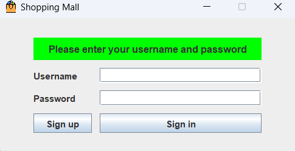
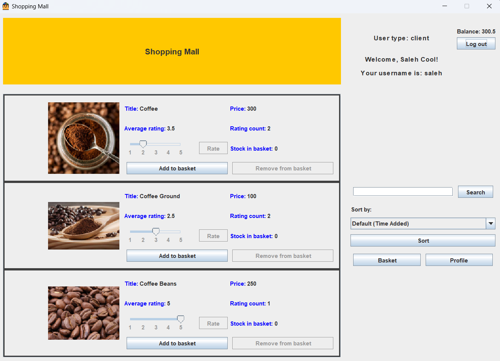
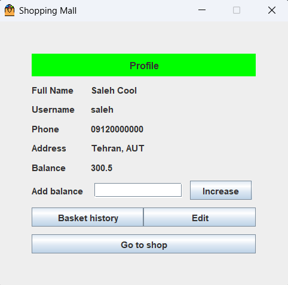
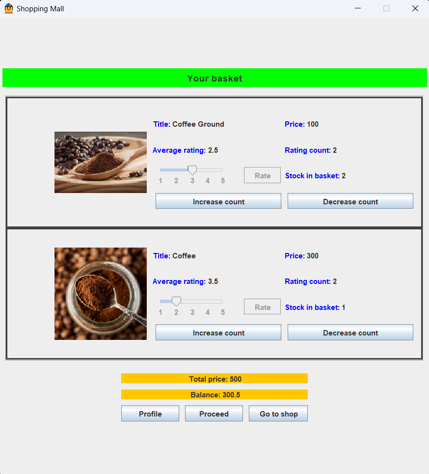
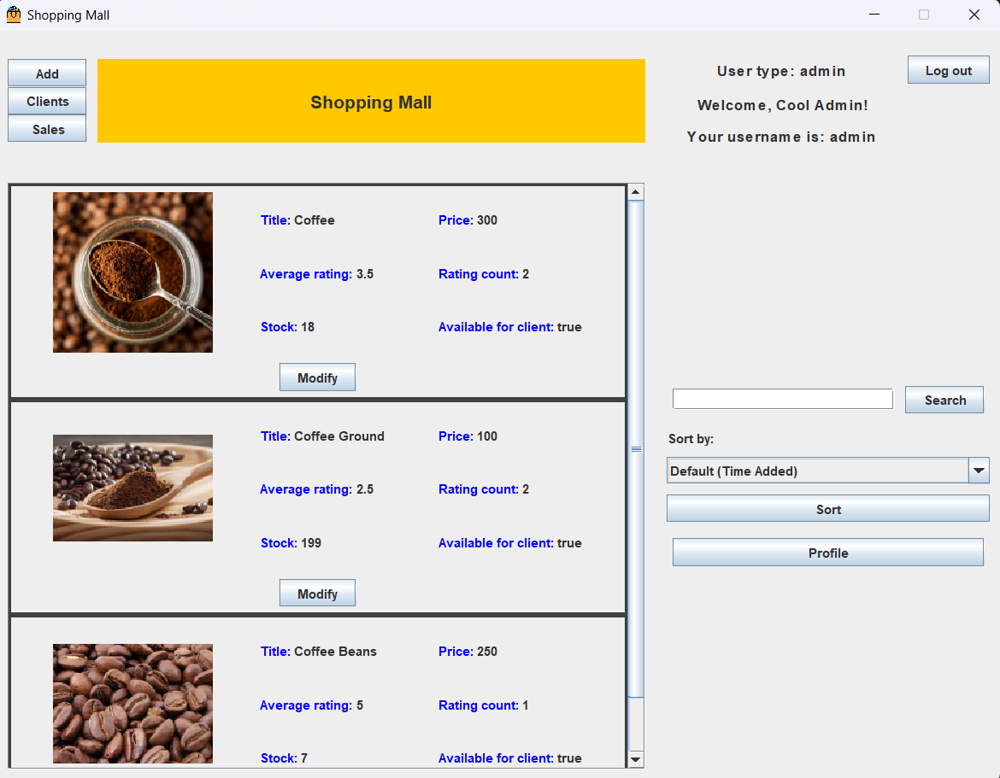
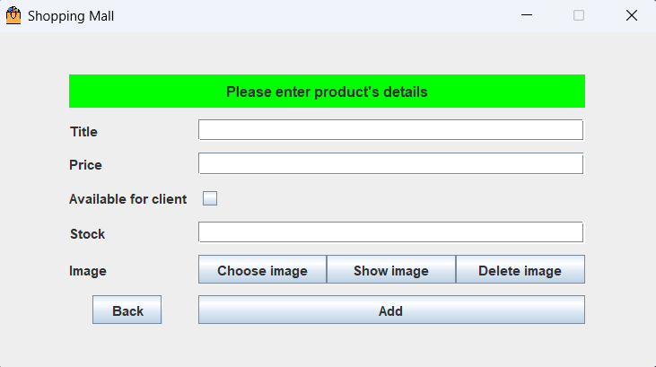
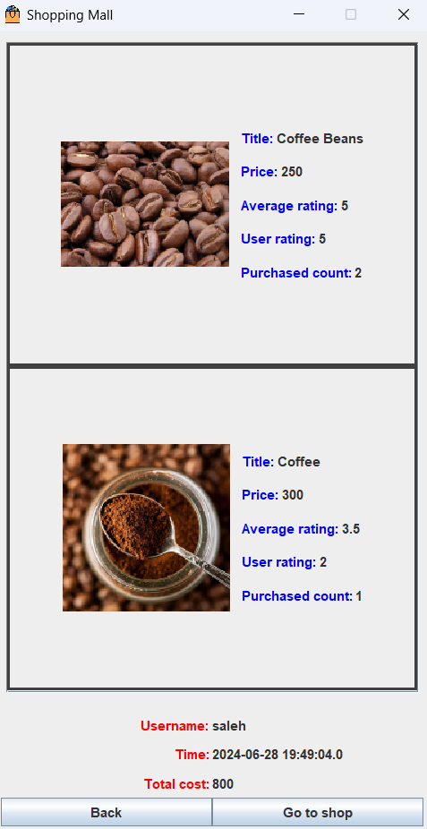

# Shopping Mall

This project is a shopping mall management application written in Java. It provides functionalities for both administrators and clients to manage products, handle baskets, and perform various other tasks related to a shopping mall.

## Project Structure

The project is divided into two main modules:
1. **app**: Contains the main application logic and user interface panels.
2. **initialization**: Contains the initialization scripts for setting up the database and other necessary configurations.

## Getting Started

### Prerequisites

- Java Development Kit (JDK) 8 or higher
- An IDE such as IntelliJ IDEA or Eclipse

### Dependencies
- mysql-connector-j-8.4.0.jar

### Installation

1. Clone the repository:

```sh
git clone https://github.com/ykazemim/shopping-mall.git
```

2. TODO

### Running the Application

TODO

### Initialization

TODO

## Usage

### Admin Functionalities

- **Add Product**: Allows admins to add new products.
- **Edit Product**: Allows admins to modify existing products.
- **View Products**: Allows admins to view all products.
- **View Clients**: Allows admins to view client profiles.
- **View Sales**: Allows admins to view sales information.

### Client Functionalities

- **View Products**: Allows clients to browse available products.
- **Add to Basket**: Allows clients to add products to their shopping basket.
- **View Basket**: Allows clients to view and manage their shopping basket.
- **Purchase History**: Allows clients to view their purchase history.
- **Edit Profile**: Allows clients to view and edit their profiles.

## User Interface (Swing)
The application uses Java Swing for the user interface. Swing provides a rich set of GUI components, making the application interactive and user-friendly. Each panel represents a different part of the application, such as product management, user authentication, and basket management.

## Database
The application uses an SQL database to store information about users, products, baskets, and transactions. The InitializeDB.java script sets up the necessary tables and populates initial data. The database ensures data integrity and supports the application's functionality.

## Security
This application uses hashing to securely store user passwords. The PasswordHasher.java class handles hashing using a secure algorithm, ensuring that plain-text passwords are never stored in the database.

## Validation
Input validation is performed using the Validator.java class to ensure that all user inputs meet the required criteria, reducing the risk of SQL injection and other security vulnerabilities.

## User-Friendly and Clean Design
The application is designed with a focus on user-friendliness and clean design. Clear navigation, consistent layouts, and responsive design principles ensure that users can easily interact with the application.

## Contributors

- [Saleh](https://github.com/MKmasterg)
- [Younes](https://github.com/ykazemim)

## Screenshots













